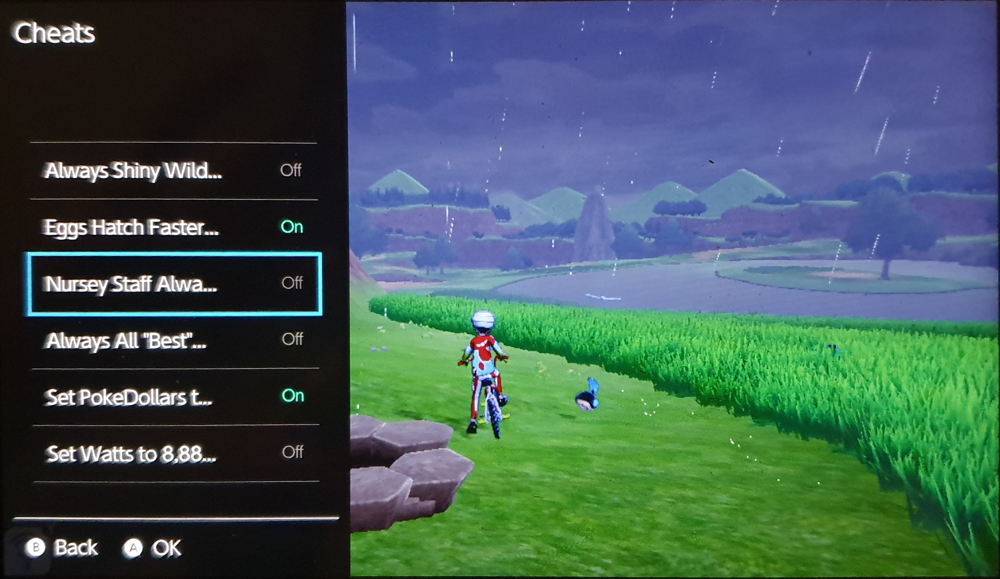

# libtesla

libtesla is the interface between the Tesla overlay loader and user-made Overlays. It handles all layer creation, UI creation, drawing and input management.
It's main goal is to make sure all overlays look and feel similar and don't differenciate themselves from the switch's native overlays.

## Screenshots

<div>
    
    
</div>

`Or rather screen pictures. Overlays do NOT show up on Screenshots.`

## Example
```cpp
#include <switch.h>
#include <tesla.hpp>


class GuiMain : public tsl::Gui {
public:
    GuiMain() { }
    ~GuiMain() { }

    // Called on UI creation
    virtual tsl::Element* createUI() {
        // A base frame containing all other elements
        auto *rootFrame = new tsl::element::Frame();

        // A CustomDrawer element that allows for direct draw actions to the framebuffer
        auto *header = new tsl::element::CustomDrawer(0, 0, 100, FB_WIDTH, [](u16 x, u16 y, tsl::Screen *screen) {
            screen->drawString("Example Overlay", false, 20, 50, 30, tsl::a(0xFFFF));
        });

        auto list = new tsl::element::List();

        auto testItem = new tsl::element::ListItem("Test List Item");
        testItem->setClickListener([](s64 keys) {
            if (keys & KEY_A == KEY_A) {
                // Do something when key A was pressed while this list item was focused

                // Return true for if this view handled the input
                return true;
            }

            return false;
        });

        // Add list item to list
        list->addItem(testItem);

        // Add header and list to the frame
        rootFrame->addElement(header);
        rootFrame->addElement(list);

        // Return the frame. This will cause it and all its children to be drawn
        return rootFrame;
    }

    // Called once per frame
    virtual void update() { }
};

class ExampleOverlay : public tsl::Overlay {
public:
    ExampleOverlay() { }
    ~ExampleOverlay() { }

    // Called once right after the overlay was launched
    tsl::Gui* onSetup() { 
        // Initialize your services here

        // Return a new Gui object here. This will be the default Gui to be shown when launching the overlay
        return new GuiMain();
    }
    
    // Called once immediately before exiting
    void onDestroy() { 
        // Exit your services here
    }

    
};


// This function will get called once on startup to load the overlay
tsl::Overlay *overlayLoad() {
    return new ExampleOverlay();
}
```
<br>

**Please Note:** While it is possible to create overlays without libtesla, it's highly recommended to not do so. libtesla handles showing and hiding of overlays, button combo detection, layer creation and a lot more. Not using it will lead to an inconsistent user experience when using multiple different overlays ultimately making it worse for the end user. If something's missing, please consider opening a PR here.

